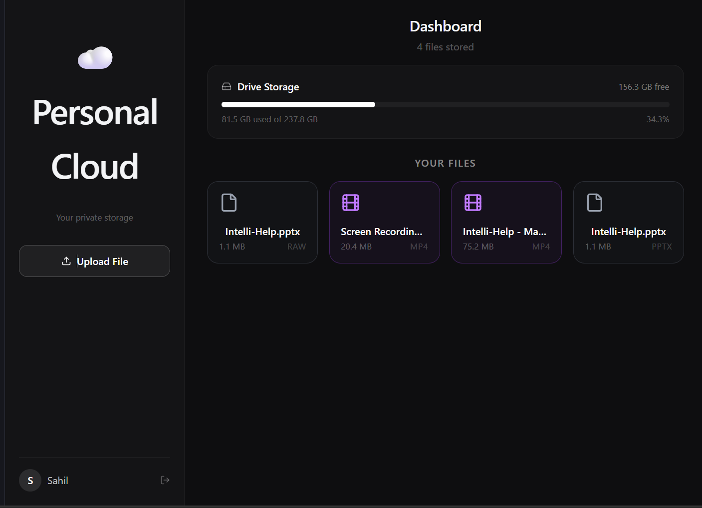

# ☁️ Personal Cloud

A self-hosted cloud storage system that lets you upload, download, and manage your files from anywhere using your own hardware as the server.

##  Why Personal Cloud?

Google Drive has storage limits.

iCloud costs money.

With Personal Cloud, you use a spare laptop or PC as your own storage server. Your upload and download speeds depend on your network and internet connection rather than a third-party provider.

---

##  Architecture

```text
Your Phone / Laptop (Frontend)
            │
            │ HTTP (LAN / Internet)
            ▼
Secondary Laptop (Backend + Storage)
            │
            ▼
MongoDB (Metadata) + Local Filesystem (Files)
```

The Flask backend runs on a dedicated storage machine, while the React frontend can be accessed from any device.

---

## ✨ Features

*  JWT-based Authentication
*  Password hashing with bcrypt
*  Chunked file uploads (5MB chunks)
*  Upload, download, and delete files
*  Storage usage tracking
*  File-type icons for better UX
*  Responsive dashboard UI
*  Fast local-network file transfers

---

## 📸 Screenshot


## 🛠️ Tech Stack

| Layer          | Technology                  |
| -------------- | --------------------------- |
| Frontend       | React + Vite + Tailwind CSS |
| Backend        | Python + Flask              |
| Database       | MongoDB                     |
| Authentication | JWT + bcrypt                |
| File Storage   | Local Filesystem            |
| Network Tunnel | Tailscale (WireGuard) |

---

##  Project Structure

```text
cloud/
├── backend/
│   ├── app.py
│   ├── uploads/
│   ├── .env
│   └── requirements.txt
│
└── frontend/
    └── src/
        ├── pages/
        │   ├── Login.jsx
        │   ├── Signup.jsx
        │   └── Dashboard.jsx
        │
        └── services/
            └── api.js
```

---

##  Backend Setup

### 1. Move to Backend

```bash
cd backend
```

### 2. Install Dependencies

```bash
pip install -r requirements.txt
```

### 3. Create Environment Variables

Create a `.env` file:

```env
MONGO_URI=mongodb://localhost:27017
SECRET_KEY=your_secret_key_here
```

### 4. Run the Server

```bash
python app.py
```

The backend will start on:

```text
http://0.0.0.0:5000
```

---

##  Frontend Setup

### 1. Move to Frontend

```bash
cd frontend
```

### 2. Install Packages

```bash
npm install
```

### 3. Start Development Server

```bash
npm run dev
```

### 4. Configure Backend URL

In:

```text
src/services/api.js
```

Set:

```javascript
const API = axios.create({
  baseURL: "http://<your-server-ip>:5000",
});
```

---

## 🔗 Connecting Two Machines (Tailscale)

To access your storage server from outside your local network:

### 1. Install Tailscale on both machines
Download from [tailscale.com](https://tailscale.com) and sign in with the same account on both devices.

### 2. Get your server's Tailscale IP
On the storage machine run:
```bash
tailscale ip
```

### 3. Update the frontend API URL
In `src/services/api.js` replace the IP with your Tailscale IP:
```javascript
const API = axios.create({
  baseURL: "http://100.x.x.x:5000",  // your Tailscale IP
});
```

That's it — your frontend can now reach your backend from anywhere in the world, peer-to-peer, with no third-party server involved.

## 🔌 API Endpoints

| Method | Endpoint      | Description        |
| ------ | ------------- | ------------------ |
| POST   | /signup       | Create Account     |
| POST   | /login        | User Login         |
| POST   | /upload-chunk | Upload File Chunks |
| GET    | /files        | List Files         |
| GET    | /download/:id | Download File      |
| DELETE | /delete/:id   | Delete File        |

---

## 🔐 Environment Variables

| Variable   | Description               |
| ---------- | ------------------------- |
| MONGO_URI  | MongoDB Connection String |
| SECRET_KEY | JWT Signing Secret        |

---

##  Roadmap

- [ ] File preview (images & PDFs)
- [ ] Mobile UI optimization  
- [ ] Folder support
- [ ] Search & filtering
- [ ] Public share links with expiry
- [ ] HTTPS support
- [x] Real disk usage from server
- [x] Chunked uploads for large files

---

## 📄 License

MIT License

---

## Contributing

Contributions, suggestions, and feature requests are welcome.

Feel free to fork the repository and submit pull requests.

---

##  Support

If you find this project useful, consider giving it a star on GitHub.
